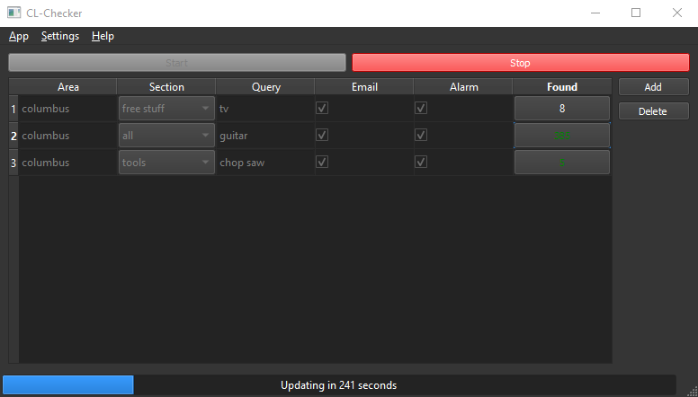
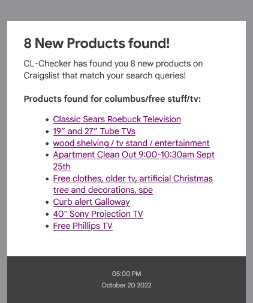
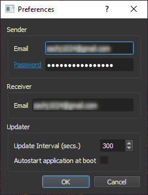

# CL-Checker

An automated **Craigslist Webscrapper** with an easy to use GUI that runs in the system tray and uses a headless instance of Google Chrome to scrape 
and detect new products based on custom search queries, and emails you a nicely formated list of the results. Written in Python, for Windows.
Download a pre-build binary [here](https://github.com/7thSamurai/CL-Checker/releases).

## Screenshots

| Main Window                                 | Example Email                   | Preferences                           |
|:-------------------------------------------:|:-------------------------------:|:-------------------------------------:|
|  |  |  |

## Running

First make sure that you have a copy of **Google Chrome** installed on your PC. Then install the Python dependencies with:

```
$ pip install -r requirements.txt
```

Now you may run the program with:

```
$ python checker.py
```

## Installation

You may alternatively build an EXE with the following command:

```
$ pyinstaller -y checker.spec
```

You can then generate an installer using [Inno Setup](https://jrsoftware.org/isinfo.php):

```
$ iscc inno_config.iss
```

## Setup

### Preferences

After you have installed the dependencies and launched the program, choose **Settings** then **Preferences** on the menu bar.
Then fill out the following fields on the settings dialog:

#### Sender
- **Email**: Set this to the GMail that you wish the notifaction emails to be sent from.
- **Password**: Set this to the app password to the above gmail account. (See [Notes](#Notes))

#### Receiver
- **Email**: Set this to the email address that you wish to receive notifactions at. You may reuse the sender email above if you so want.

#### Updater
- **Update Interval**: Set this to the number of seconds of delay you wish there to be between every update.
- **Autostart**: Click this checkbox to enable the application to automatically start running in the systemtray at boot.

### Settings Up Queries

Now that you have the preferences filled out, you may now setup your desired search queries. Please follow the steps listed below:

- First click the large red button labeled **"Stop"**. This will stop the updater.
- Now click the button on the right side of the window labeled **"Add"**. This will add a new query to the table.
- Now choose the newly added query in the table, and enter in the name of the nearest large city near you, in the column labeled **"Area"**.
  (You may find what cities are available to use by going to the Craigslist website)
- Then pick an option from the drop-down-box in the column labled **"Section"**, to choose what filters to apply.
- Enable or disable the **"Email"** checkbox to receive emails notifcations when new products are found.
- Enable or disable the **"Alarm"** checkbox to have a alarm sound play when new products are found. 
- Finally, restart the updater by clicking the green button labeled **"Start"**.

## Notes

- For the sender email, only GMail addresses are allowed. The recipient email can be at any providor.
- For the email password you need to generate an GMail app password. You can find instructions on how to do this [here](https://www.lifewire.com/get-a-password-to-access-gmail-by-pop-imap-2-1171882).

## Copyright

This software is licensed under GPL3. Copyright &copy; 2022 Zach Collins
